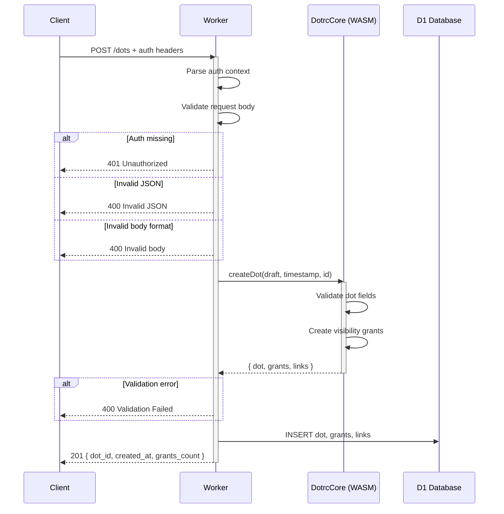
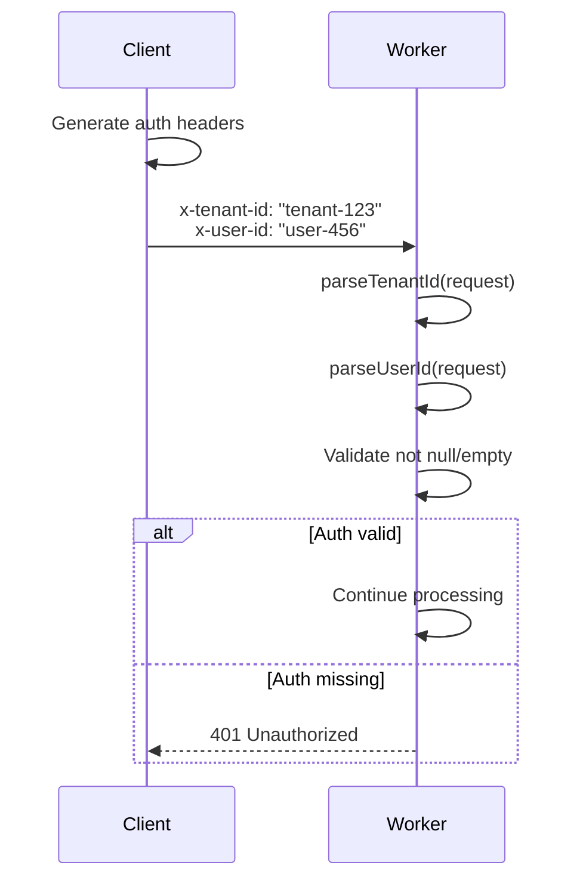
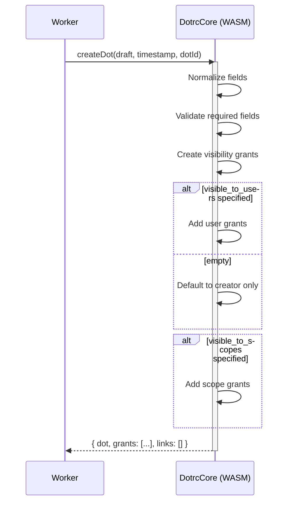

# dotrc-worker

Cloudflare Worker adapter for DotRC.

## Architecture

This worker provides a REST API that:

1. Receives HTTP requests
2. Parses auth context (tenant/user from headers, TODO: JWT/Slack)
3. Calls `dotrc-core` via WASM for validation and policy decisions
4. Persists write-sets to D1 (Cloudflare's SQL database)
5. Returns results to the client

**Core principle:** The worker is a thin adapter. All domain logic lives in `dotrc-core`.

## Current Status

✅ **Implemented:**

- WASM module loading
- `DotrcCore` wrapper with type safety
- POST /dots endpoint using core validation
- Timestamp + ID generation utilities
- Basic auth context parsing (headers)

🚧 **TODO:**

- D1 persistence layer
- Slack auth integration
- Additional endpoints (grant access, create links, query dots)
- Error handling improvements

## Development

```bash
# Install dependencies (from repo root)
pnpm install

# Type-check TypeScript
make lint
# or: pnpm typecheck (in this directory)

# Run tests
pnpm test
# or: make test-worker (from repo root, runs all tests)

# Build WASM (required before running worker)
./scripts/build-wasm.sh

# Run locally
make dev-worker
# or: cd apps/dotrc-worker && pnpm dev
```

The dev server will start at `http://localhost:8787`

## API

### Health Check

**Request:**

```bash
curl http://localhost:8787/
```

**Response:**

```json
{
  "status": "ok",
  "service": "dotrc-worker"
}
```

### Create Dot

**Request:**

```bash
curl -X POST http://localhost:8787/dots \
  -H "x-tenant-id: tenant-123" \
  -H "x-user-id: user-456" \
  -H "content-type: application/json" \
  -d '{
    "title": "Meeting notes",
    "body": "Discussed Q1 roadmap",
    "tags": ["meeting", "planning"],
    "scope_id": "slack-channel-123",
    "visible_to_users": ["user-456"],
    "visible_to_scopes": ["slack-channel-123"]
  }'
```

**Response (201 Created):**

```json
{
  "dot_id": "dot-1234567890ab",
  "created_at": "2025-12-20T21:33:00Z",
  "grants_count": 3
}
```

**Error: Missing Auth (401):**

```json
{
  "error": "unauthorized",
  "detail": "Missing tenant or user authentication"
}
```

**Error: Invalid JSON (400):**

```json
{
  "error": "invalid_json",
  "detail": "Unexpected token"
}
```

**Error: Validation (400):**

```json
{
  "error": "validation_failed",
  "detail": "title is required"
}
```

### Request Format

All requests should include:

- `x-tenant-id` header (required)
- `x-user-id` header (required)
- `content-type: application/json` for POST requests

### Response Format

All responses include:

- `content-type: application/json; charset=utf-8`
- Appropriate HTTP status code
- JSON body with either data or error fields

## Flow Diagrams

### POST /dots Flow



### Auth Context



### Core Policy Decision



## WASM Integration

The worker loads the WASM module at startup:

```typescript
import * as wasm from "../../crates/dotrc-core-wasm/pkg/dotrc_core_wasm.js";
const core = new DotrcCore(wasm);

// Use core for all operations
const result = core.createDot(draft, timestamp, dotId);
```

All validation, normalization, and policy decisions happen in WASM (pure Rust), ensuring:

- Consistent behavior across adapters
- Type-safe operations
- No business logic in the worker layer

## Deployment

```bash
# Deploy to Cloudflare Workers
cd apps/dotrc-worker
pnpm deploy
```

**Prerequisites:**

- Cloudflare account
- Wrangler CLI configured (`wrangler login`)
- D1 database created (see wrangler.toml)

## Environment Variables

None yet. Configuration will be added for:

- Slack API credentials
- JWT signing keys
- Feature flags
