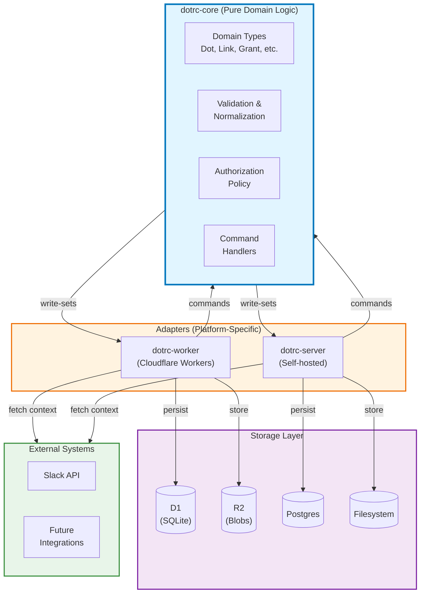
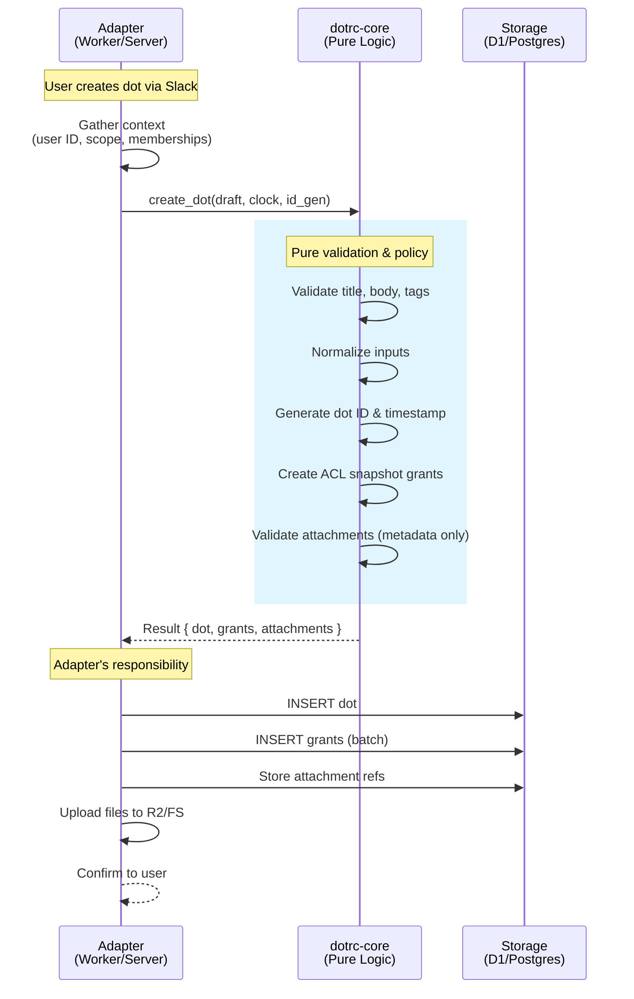
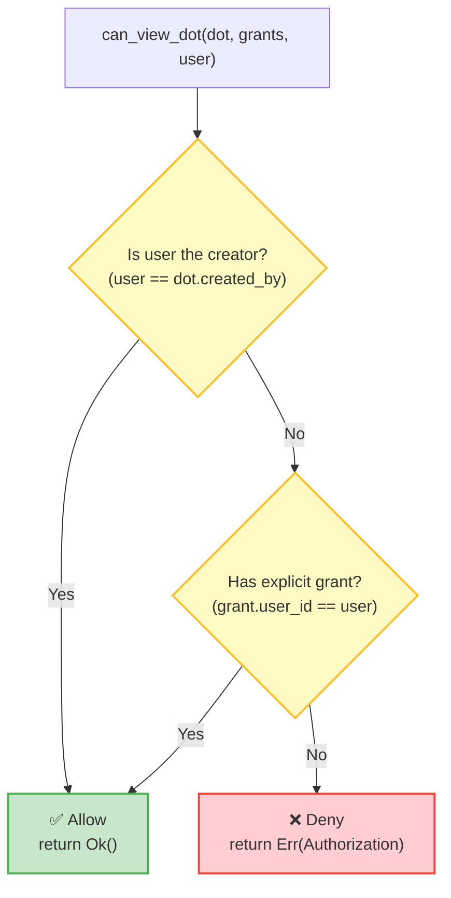

# Core Architecture

Defines the contract for dotrc-core: what it contains, what it must not contain, and how adapters interact with it.

## High-Level Architecture



## Pure Core Principles

**dotrc-core is portable, pure, and integration-agnostic:**

### What Core MUST NOT contain:

- ❌ No I/O operations (file system, network, database)
- ❌ No async runtime dependencies
- ❌ No platform-specific code (Cloudflare APIs, Node.js, etc.)
- ❌ No external service calls (Slack, APIs)
- ❌ No global mutable state
- ❌ No direct persistence logic

### What Core MUST contain:

- ✅ Immutable domain types (`Dot`, `Link`, `VisibilityGrant`, etc.)
- ✅ Validation and normalization (pure functions)
- ✅ Authorization policy decisions
- ✅ Command handlers returning write-sets
- ✅ Explicit error types

### Why This Matters:

1. **Reusability**: Same core runs in Workers (WASM), servers (native), and tests
2. **Testability**: Deterministic, no mocking required
3. **Portability**: Supports `no_std` environments
4. **Correctness**: Pure functions → predictable behavior

## Command → Write-Set Pattern

Core uses a **command → write-set** pattern where adapters gather context, core makes decisions, and adapters persist results.



## Core Modules

### `types.rs` — Domain Primitives

Immutable types representing domain concepts:

- **Identifiers**: `TenantId`, `UserId`, `ScopeId`, `DotId`
- **Entities**: `Dot`, `Link`, `VisibilityGrant`, `AttachmentRef`
- **Drafts**: `DotDraft` (input for creation)
- **DI Traits**: `Clock`, `IdGen` (adapters implement)

**Key Invariants:**

- Dots are immutable (no mutable fields)
- All entities are tenant-scoped
- IDs are opaque strings (adapters choose format)

### `errors.rs` — Error Taxonomy

**Two-Layer Error System:**

1. **`DotrcError` enum** — Detailed variants with rich context:

   - `Validation(ValidationError)` — Invalid input (title too long, bad tags, etc.)
   - `Authorization(AuthorizationError)` — Permission denied
   - `InvalidLink(InvalidLinkError)` — Self-reference, cross-tenant, duplicate
   - `NotImplemented` — Placeholder for unimplemented features

2. **`DotrcErrorKind` enum** — Classification for HTTP status mapping:
   - `Validation` — Client errors (HTTP 400)
   - `Authorization` — Permission errors (HTTP 403)
   - `Link` — Link operation errors (HTTP 500)
   - `ServerError` — Unexpected/unimplemented (HTTP 500)

All `DotrcError` variants expose a `.kind()` method for classification:

```rust
pub enum DotrcErrorKind {
    Validation,    // Client error: bad input
    Authorization, // Client error: insufficient permissions
    Link,          // Server error: invalid link operation
    ServerError,   // Server error: unexpected failures
}
```

**Purpose**: Enable adapters to map errors to appropriate HTTP status codes or UI messaging without string matching:

- `Validation` → HTTP 400 Bad Request
- `Authorization` → HTTP 403 Forbidden
- `Link` → HTTP 500 Internal Server Error
- `ServerError` → HTTP 500 Internal Server Error

### `normalize.rs` — Validation & Canonicalization

Pure functions to normalize and validate:

```rust
normalize_title("  Too Many   Spaces  ") → "Too Many Spaces"
normalize_tag("My-Tag") → "my-tag"  // lowercase, validated
validate_attachment_size(bytes, max) → Ok(()) | Err(..)
```

All functions are deterministic. Same inputs always produce same outputs.

### `policy.rs` — Authorization Logic

Answers "can this user do X?" based on provided facts:

```rust
can_view_dot(dot, grants, context) → Result<()>
can_grant_access(dot, grants, context) → Result<()>
can_create_link(source, target, grants, context) → Result<()>
```

**Context**: Adapters provide `AuthContext` with user ID and scope memberships.

**Enforcement Rules:**

- Creator can always view their dots
- Explicit principal grants confer access
- Scope grants are provenance only (not enforcement)



**Key Design**: Policy functions are **pure decision logic**. They don't fetch data—adapters provide all facts as inputs.

### `commands.rs` — Write-Set Handlers

Commands return records to persist (no side effects):

```rust
create_dot<C: Clock, I: IdGen>(draft, clock: &C, id_gen: &I) → Result<CreateDotResult>
  // Returns: { dot, grants, links }
  // Note: clock and id_gen are trait-bounded generic references

grant_access<C: Clock>(dot, existing_grants, target_users, target_scopes, context, clock: &C) → Result<GrantAccessResult>
  // Returns: { grants: Vec<VisibilityGrant> }

create_link<C: Clock>(from_dot, to_dot, link_type, grants, existing_links, context, clock: &C) → Result<CreateLinkResult>
  // Returns: { link: Link }
  // Note: grants is LinkGrants { from: &[VisibilityGrant], to: &[VisibilityGrant] }
```

Adapters persist the returned records.

## Adapter Responsibilities

Adapters bridge external systems to the pure core:

### Before Calling Core:

1. **Resolve identities** — Map Slack user → internal `UserId`
2. **Gather context** — Fetch scope memberships, existing grants
3. **Implement DI traits** — Provide `Clock` (timestamps) and `IdGen` (ID generation)

### After Core Returns:

1. **Persist write-sets** — Insert dots, grants, links into database
2. **Store files** — Upload attachments to R2/filesystem
3. **Update indexes** — Maintain search indexes, caches
4. **Notify users** — Send confirmations via Slack/webhooks

### Adapter-Specific Logic:

- **Scope membership expansion**: When creating dots with scope visibility, adapters **must** resolve current scope members to explicit user grants **before calling core**. Core receives the expanded list in `draft.visible_to_users`.
- **Multi-tenancy**: Ensure all operations are tenant-scoped
- **Rate limiting, quotas**: Adapters enforce, core doesn't know
- **External API calls**: Adapters handle, core receives results as input

## Compilation Targets

**Native Rust** (`dotrc-server`):

```bash
cargo build --release
```

**WASM** (`dotrc-worker`):

```bash
wasm-pack build crates/dotrc-core-wasm --target bundler
```

**No-std** (embedded, constrained environments):

```bash
cargo build --no-default-features
```

Core supports all three with conditional compilation.

## Testing Strategy

### Unit Tests

Every module has comprehensive unit tests:

```rust
#[cfg(test)]
mod tests {
    // Test validation, normalization, policy decisions
}
```

### Integration Tests

End-to-end flows in `tests/integration_test.rs`:

```rust
test_full_workflow_create_and_view
test_full_workflow_grant_access
test_full_workflow_links_and_superseding
```

### Doc Tests

Examples in module docs are executable:

````rust
/// ```rust
/// use dotrc_core::commands::create_dot;
/// // ...
/// ```
````

All tests are deterministic (no network, no time dependencies).

## Example: Creating a Dot

```rust
use dotrc_core::{commands::create_dot, types::*};

// 1. Adapter implements DI traits
struct MyClock;
impl Clock for MyClock {
    fn now(&self) -> Timestamp {
        chrono::Utc::now().to_rfc3339()
    }
}

struct MyIdGen;
impl IdGen for MyIdGen {
    fn generate_dot_id(&self) -> DotId {
        DotId::new(uuid::Uuid::new_v4().to_string())
    }
    fn generate_attachment_id(&self) -> String {
        uuid::Uuid::new_v4().to_string()
    }
}

// 2. Adapter prepares draft with gathered context
let draft = DotDraft {
    title: "Meeting notes".to_string(),
    body: Some("Discussed Q1 roadmap".to_string()),
    created_by: UserId::new("user-123"),
    tenant_id: TenantId::new("acme-corp"),
    scope_id: Some(ScopeId::new("eng-channel")),
    visible_to_users: vec![UserId::new("user-123"), UserId::new("user-456")],
    visible_to_scopes: vec![ScopeId::new("eng-channel")],
    tags: vec!["meeting".to_string()],
    attachments: vec![],
};

// 3. Call core (pure, deterministic)
let result = create_dot(draft, &MyClock, &MyIdGen)?;

// 4. Adapter persists write-set
db.insert_dot(&result.dot).await?;
db.insert_grants(&result.grants).await?;
// ...
```

## Key Takeaways

- **Core is pure** — No I/O, no side effects, deterministic
- **Adapters handle I/O** — Fetch context, persist write-sets
- **Command → Write-Set** — Core returns records, adapters persist
- **Portable** — Runs in Workers (WASM), servers (native), tests
- **Testable** — All logic is unit-testable without mocks
- **Explicit** — No magic, no hidden state, clear boundaries
