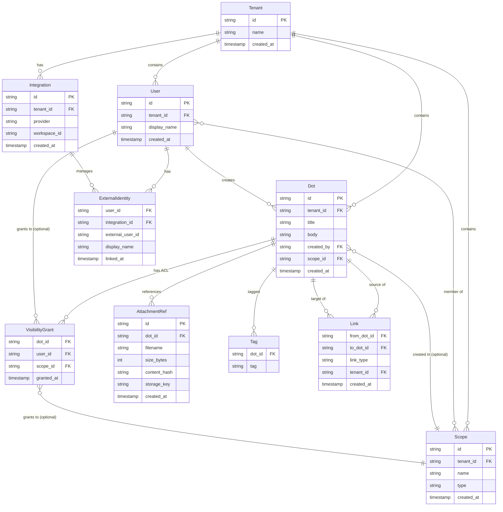
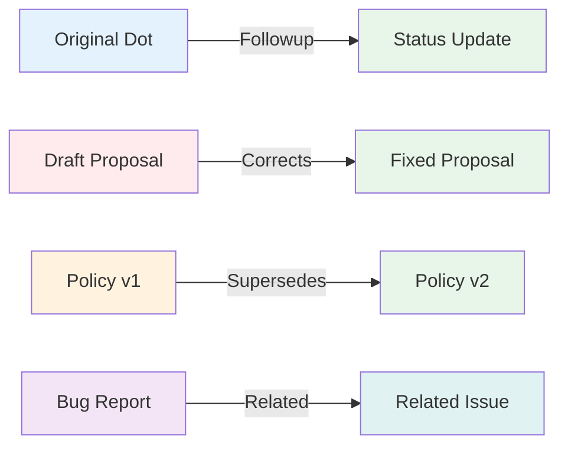

# Data Model

Defines the domain nouns: Dot, Scope, Link, VisibilityGrant (ACL), Attachment, Integration, ExternalIdentity, Tenant.
This is conceptual (not SQL).

## Entity Relationship Diagram



## Core Entities

### Tenant

**Purpose**: Multi-tenancy isolation boundary.

**Fields**:

- `id` (PK): Unique tenant identifier
- `name`: Human-readable tenant name
- `created_at`: Timestamp when tenant was created

**Invariants**:

- All other entities belong to exactly one tenant
- Cross-tenant access is forbidden
- Tenants cannot see each other's data

**Examples**: Companies, organizations, isolated workspaces

---

### User

**Purpose**: Internal identity for a person who creates and views dots.

**Fields**:

- `id` (PK): Internal user UUID
- `tenant_id` (FK): Owning tenant
- `display_name`: Human-friendly name
- `created_at`: When user was created

**Invariants**:

- Users are tenant-scoped
- One person may have multiple `ExternalIdentity` records (Slack, future integrations)
- User IDs are stable across external identity changes

**Relationships**:

- Creates dots
- Receives explicit visibility grants
- Member of zero or more scopes
- Linked to external identities (Slack users, etc.)

---

### Scope

**Purpose**: Represents context where a dot was created (channel, team, project).

**Fields**:

- `id` (PK): Unique scope identifier
- `tenant_id` (FK): Owning tenant
- `name`: Human-readable name (e.g., "#engineering")
- `type`: Scope category (e.g., "slack_channel", "team", "project")
- `created_at`: When scope was registered

**Invariants**:

- Scopes are tenant-scoped
- Scopes indicate provenance, not enforcement
- Membership is tracked separately (User ↔ Scope relationship)

**Visibility Semantics**:

- When a dot references a scope in `visible_to_scopes`, adapters should expand current scope members into explicit user grants
- Scopes in `VisibilityGrant` records are provenance only—core does not dynamically infer access from current scope membership

**Examples**: Slack #engineering channel, "Q1 Planning" project, "Exec Team" group

---

### Dot

**Purpose**: An immutable, timestamped record capturing a single fact or observation.

**Fields**:

- `id` (PK): Unique dot identifier
- `tenant_id` (FK): Owning tenant
- `title`: Required, short summary (max 200 chars)
- `body`: Optional, longer content (max 50k chars)
- `created_by` (FK → User): Creator's internal user ID
- `scope_id` (FK → Scope, optional): Context where dot was created
- `created_at`: RFC3339 timestamp
- `tags`: List of lowercase, normalized tags (max 10)
- `attachments`: References to attachment metadata

**Invariants**:

- Dots are **never edited or deleted**
- Title is required and normalized (trimmed, length-checked)
- Tags are lowercase, alphanumeric + hyphens/underscores
- All fields are immutable after creation
- Must have at least one visibility grant (users or scopes)

**Corrections & Updates**:

- Use `Link` with type `Corrects` or `Supersedes` to relate new dot to old
- Original dot remains intact; UIs may show the newest version

**Access Control**:

- Creator always has access
- Access for others determined by `VisibilityGrant` records

---

### Link

**Purpose**: Directed, typed relationship between two dots.

**Fields**:

- `from_dot_id` (FK → Dot): Source dot
- `to_dot_id` (FK → Dot): Target dot
- `link_type`: Semantic type (`Followup`, `Corrects`, `Supersedes`, `Related`)
- `tenant_id` (FK): Owning tenant
- `created_at`: When link was created
- `created_by` (implicit): User who created the link

**Link Types**:



- **Followup**: B continues or updates A's thread
- **Corrects**: B fixes errors or clarifies A
- **Supersedes**: B replaces A as the current version
- **Related**: B and A share context but no correction/sequence

**Invariants**:

- Links are directed: A → B ≠ B → A
- No self-references: A cannot link to A
- Cross-tenant links forbidden
- Duplicate links (same from, to, type) rejected
- Both source and target must be visible to creator

**Chains**:

- Links do NOT form required chains
- Dots exist independently; links are optional metadata
- UIs may traverse links to build "trails" (derived views)

---

### VisibilityGrant

**Purpose**: Explicit, append-only ACL record granting access to a dot.

**Fields**:

- `dot_id` (FK → Dot): Dot being granted access to
- `user_id` (FK → User, optional): Specific user granted access
- `scope_id` (FK → Scope, optional): Scope grant (provenance)
- `granted_at`: Timestamp when grant was created
- `granted_by` (implicit): User who created the grant

**ACL Snapshot Rules**:

- At dot creation, visibility is captured as an **immutable snapshot**
- Grants enumerate principals: either `user_id` OR `scope_id` (at least one)
- Adapters should expand scope references into explicit user grants at creation

**Enforcement**:

- Core checks **explicit user grants** only
- Scope grants are provenance (context) but do not confer access dynamically
- Later sharing = append new `VisibilityGrant` records

**Invariants**:

- Grants are **append-only** (never updated or deleted)
- No retroactive changes—new members don't gain access to past dots without explicit grants
- All grants are tenant-scoped

**Example**:

```
Dot: "Q1 Planning Notes"
Grants at creation:
  - user_id: alice  (creator)
  - user_id: bob    (explicit)
  - user_id: carol  (explicit)
  - scope_id: engineering  (provenance only)

Later grant (sharing):
  - user_id: dave   (added later)
```

Alice, Bob, Carol, and Dave can view. New `#engineering` members cannot unless explicitly granted.

---

### AttachmentRef

**Purpose**: Metadata reference to an externally stored file.

**Fields**:

- `id` (PK): Unique attachment identifier
- `dot_id` (FK → Dot): Owning dot
- `filename`: Original filename
- `size_bytes`: File size for validation/display
- `content_hash`: Integrity hash (format: `algorithm:hash`, e.g., `sha256:abc123...`)
- `storage_key`: Adapter-specific key (R2 path, filesystem path, etc.)
- `created_at`: Upload timestamp

**Invariants**:

- Attachments are immutable metadata
- Core validates metadata (filename, size limits)
- Adapters handle actual file storage and retrieval
- Content hash enables integrity verification

**Limits**:

- Max filename length: 255 chars
- Max file size: 100 MB (configurable per adapter)
- No path separators in filename (`/`, `\`)

---

### Tag

**Purpose**: Optional, sparse labels for categorization.

**Fields**:

- `dot_id` (FK → Dot): Dot being tagged
- `tag`: Normalized tag string

**Normalization**:

- Lowercase: `MyTag` → `mytag`
- Alphanumeric + hyphens/underscores: `my-tag_2` ✓
- Spaces rejected: `my tag` ✗

**Limits**:

- Max 10 tags per dot
- Max tag length: 50 chars
- Duplicates removed

**Philosophy**:

- Tags are lightweight, not relationships
- Prefer links for semantic connections
- Use tags for filtering/grouping, not structure

---

### ExternalIdentity

**Purpose**: Maps internal `User` to external service identities.

**Fields**:

- `user_id` (FK → User): Internal user
- `integration_id` (FK → Integration): Which service (Slack, future)
- `external_user_id`: User ID in external system (e.g., Slack U0123456)
- `display_name`: Name from external system
- `linked_at`: When identity was linked

**Why Separate**:

- Users are stable, external IDs change (re-linking Slack)
- One user can have multiple external identities
- External identities can be unlinked without losing user history

---

### Integration

**Purpose**: Tenant's connection to an external service.

**Fields**:

- `id` (PK): Integration identifier
- `tenant_id` (FK): Owning tenant
- `provider`: Service type (e.g., "slack", "github")
- `workspace_id`: External workspace/org identifier
- `created_at`: When integration was configured
- `credentials` (not shown): Tokens, secrets (adapter-managed, encrypted)

**Why Tenant-Level**:

- One Slack workspace per tenant
- Keeps tokens separate from user identity
- Enables clean multi-tenancy

---

## Conceptual Constraints

### Immutability

- Dots, Grants, Links, and Attachments are **never edited**
- Updates = create new dot + link
- No "soft deletes" or status flags

### Append-Only History

- All changes are additive
- History is reconstructable from append log
- No retroactive visibility changes

### Explicit Visibility

- Access is granted explicitly via `VisibilityGrant`
- No implicit access via current scope membership
- Scopes are context/provenance, not enforcement

### Tenant Isolation

- All entities scoped to tenant
- Cross-tenant queries/links forbidden
- Tenants are completely isolated

### No Required Chains

- Dots exist independently
- Links are optional relationships
- No parent/child requirements

---

## Summary

**Immutable Entities**: Dot, Link, VisibilityGrant, AttachmentRef  
**Identity Entities**: Tenant, User, ExternalIdentity, Integration  
**Context Entities**: Scope, Tag

**Key Principle**: Dots are self-contained facts. Everything else (links, tags, scopes) adds context but doesn't change the core immutability or append-only nature of the system.
