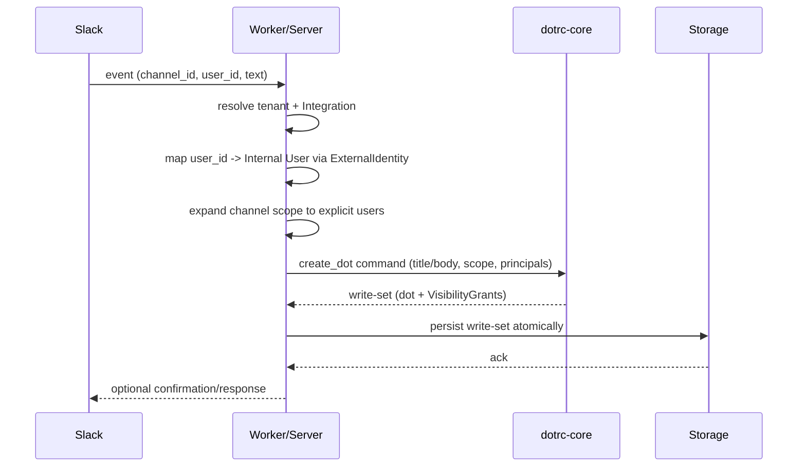

# Integrations

How DotRC models external systems and identities, and how adapters mediate between providers and the pure core.

## Concepts

- **Integration**: Tenant-level record for a provider (e.g., Slack). Holds provider type and workspace/org identifiers; credentials live with the adapter, not in core.
- **ExternalIdentity**: Per-user mapping to a provider user id (e.g., Slack U123). Keeps internal users stable across re-linking or workspace migrations.
- **Adapter Boundary**: Adapters (worker/server) handle auth, provider SDKs, and storage. Core remains pure and provider-agnostic.

## Responsibilities

- Adapters:

  - Verify tenant credentials with the provider.
  - Resolve inbound identities (e.g., Slack user id → Internal user via `ExternalIdentity`).
  - Expand scopes to explicit principals at dot creation.
  - Persist core write-sets atomically (dots, links, grants, attachments metadata).
  - Manage secrets/credentials; never surface them to core.

- Core:
  - Validate commands and apply policy (can_view/can_grant/can_link).
  - Emit deterministic write-sets; performs no I/O and does not call provider APIs.

## Sequence: Slack message → Dot

## Boundaries and Safety

- Credentials and provider tokens stay in the adapter layer.
- Cross-tenant references are invalid; integration and identities must match the tenant of the dot.
- No retroactive access: scope membership is expanded once at creation; later sharing uses new grants.
- Core never depends on provider runtime or SDKs, enabling portability (WASM/worker/server).
