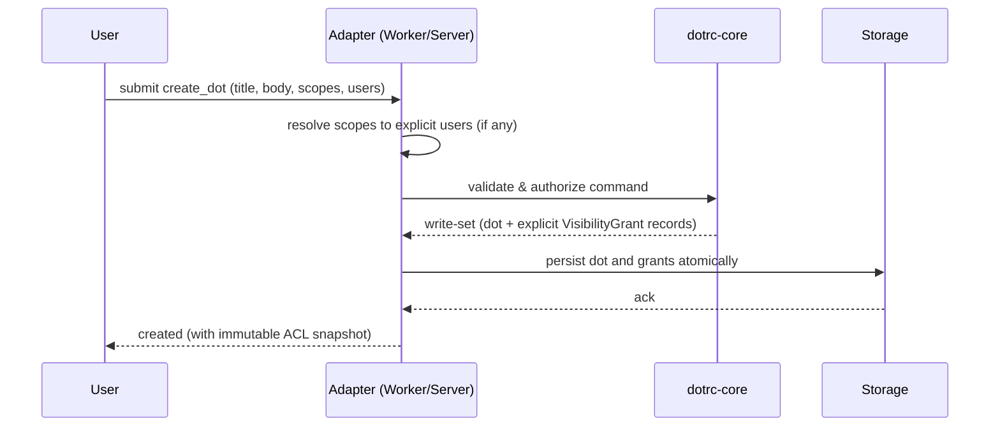
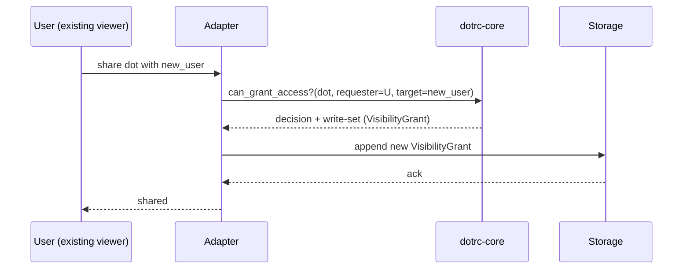

# Visibility and Security Model

DotRC enforces safety through explicit, immutable visibility snapshots. No dynamic lookups; no retroactive access.

## Core Rules

- **Snapshot at creation:** Dot visibility is captured as an immutable list of principals (users) when the dot is created.
- **Explicit grants only:** Later sharing is modeled as new `VisibilityGrant` records. No inference from current group/channel membership.
- **Scopes as provenance:** Scopes describe context; adapters may record them, but enforcement uses explicit user principals only.
- **Immutability:** Dots and grants are append-only; corrections or superseding happen via typed links, not mutation.

## Sequence: Create Dot with ACL Snapshot

Key points:

- Scope membership is expanded once at creation time into explicit user grants.
- The snapshot is immutable; later changes require new grants.

## Sequence: Later Sharing (Append Grant)

Key points:

- Only creators or existing viewers can share.
- Sharing is append-only; no overwrites or deletions of grants.

## Enforcement in Core

- `can_view_dot()`: allowed if requester is creator or explicitly present in a grant.
- `can_grant_access()`: requester must be creator or existing viewer.
- `can_create_link()`: requester must view both source and target dots.

## Implications and Edge Cases

- New members of a scope/channel do **not** gain access to past dots unless explicit grants are added.
- Removing someone from a scope does **not** revoke past access; revocation (if ever added) must be modeled as an append-only record and interpreted by adapters.
- Cross-tenant grants are invalid; all principals and dots must share the tenant.

## Multi-Tenancy and Auditability

- All dots and grants are tenant-scoped; adapters must enforce tenant consistency on write.
- Decisions are reconstructable from the append-only history of dots and grants; scopes and links add context but never override ACLs.
