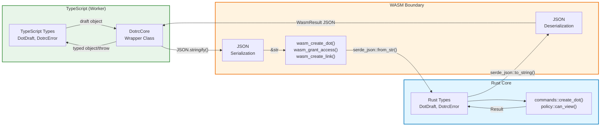
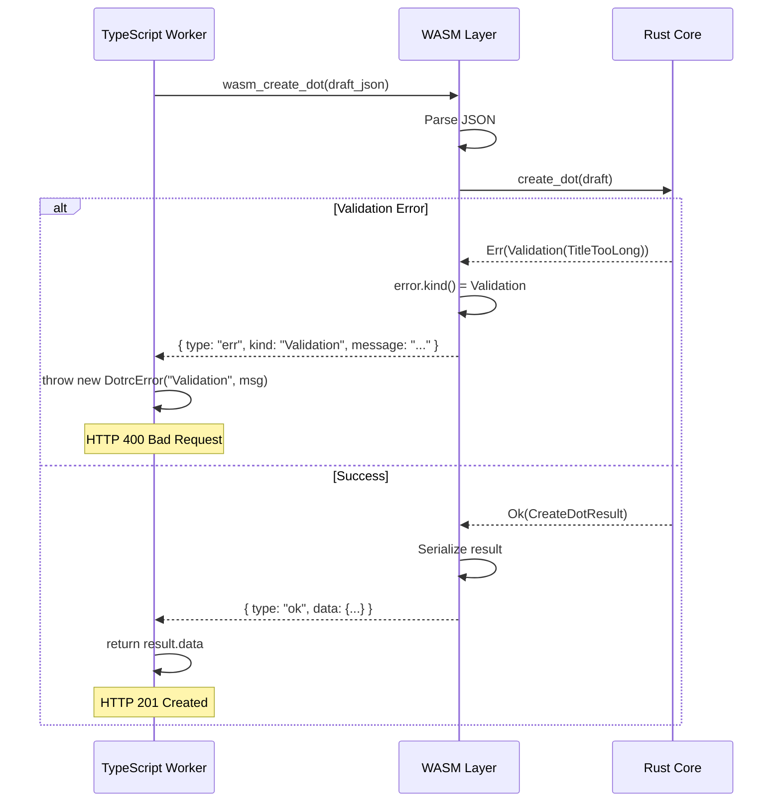

# WASM Layer Implementation Summary

A production-ready WASM bridge between `dotrc-core` (pure Rust) and JavaScript/TypeScript environments.

## Data Flow Architecture



**Key Insight**: The WASM layer is a **pure serialization adapter**. No logic lives here—only type conversion.

### Files Created/Modified

#### Rust WASM Bindings

- **[crates/dotrc-core-wasm/src/lib.rs](crates/dotrc-core-wasm/src/lib.rs)** - Complete WASM bindings with:
  - JSON-based interface (simple, debuggable, language-agnostic)
  - Explicit dependency injection (time + IDs from adapter)
  - 5 core command exports: `create_dot`, `grant_access`, `create_link`, `can_view_dot`, `filter_visible_dots`
  - Structured error handling with typed results

#### TypeScript Integration

- **[apps/dotrc-worker/src/types.ts](apps/dotrc-worker/src/types.ts)** - Full type definitions:

  - Core domain types matching Rust serialization
  - Result/error types for WASM responses
  - Helper utilities for error handling

- **[apps/dotrc-worker/src/core.ts](apps/dotrc-worker/src/core.ts)** - Type-safe wrapper class:
  - `DotrcCore` class wrapping raw WASM exports
  - Automatic JSON serialization/deserialization
  - Typed methods with proper TypeScript signatures
  - Error unwrapping and exception handling

#### Build Infrastructure

- **[scripts/build-wasm.sh](scripts/build-wasm.sh)** - Automated build script
- **[crates/dotrc-core-wasm/Cargo.toml](crates/dotrc-core-wasm/Cargo.toml)** - Optimized release profile
- **[test-wasm.mjs](test-wasm.mjs)** - Integration test

## Architecture Decisions

### 1. JSON Boundary

**Why**: Simple, debuggable, no complex FFI types

- Adapter serializes to JSON → WASM deserializes
- Core processes → WASM serializes result → Adapter deserializes
- Easy to inspect, log, and debug

### 2. Explicit Dependency Injection

**Why**: Keeps core pure, adapter controls environment

- Time: Adapter passes RFC3339 timestamp string
- IDs: Adapter generates and passes dot/attachment IDs
- No WASM-side clock or crypto dependencies

### 3. Structured Result Type

**Why**: Type-safe error handling in TypeScript

```typescript
type DotrcErrorKind = "Validation" | "Authorization" | "Link" | "ServerError";

type WasmResult<T> =
  | { type: "ok"; data: T }
  | { type: "err"; kind: DotrcErrorKind; message: string };
```

Error kinds flow from Rust core → WASM → TypeScript with consistent semantics:

- **Validation**: Bad input (HTTP 400)
- **Authorization**: Permission denied (HTTP 403)
- **Link**: Invalid link operation (HTTP 500)
- **ServerError**: Unexpected failures (HTTP 500)

This enables type-safe error handling without brittle string matching.



Error kinds flow from Rust core → WASM → TypeScript with consistent semantics:

- **Validation**: Bad input (HTTP 400)
- **Authorization**: Permission denied (HTTP 403)
- **Link**: Invalid link operation (HTTP 500)
- **ServerError**: Unexpected failures (HTTP 500)

This enables type-safe error handling without brittle string matching.

### 4. Small Binary Optimizations

```toml
[profile.release]
opt-level = "z"  # Optimize for size
lto = true       # Link-time optimization
strip = true     # Strip symbols
```

## How It Works

```typescript
// 1. Initialize WASM module
import init, * as wasm from "./pkg/dotrc_core_wasm.js";
await init(wasmBytes);

// 2. Wrap with type-safe client
const core = new DotrcCore(wasm);

// 3. Call methods with full type safety
const result = core.createDot(draft, "2025-12-20T12:00:00Z", "dot-123");
// Returns: { dot, grants, links }
// Throws: DotrcError on validation/auth failure
```

## Integration Points

### Cloudflare Workers

- WASM module loaded at startup
- Zero cold-start penalty (WASM is pre-compiled)
- No Node.js APIs used

### Node.js (for testing)

- Explicit file loading
- Same interface as Workers

### Browser (future)

- Auto-fetch WASM binary
- Same interface as Workers

## Testing

```bash
./scripts/build-wasm.sh                                  # Build
node crates/dotrc-core-wasm/tests/integration.mjs       # Test
```

Current test verifies:

- ✓ WASM module loads
- ✓ `core_version()` works
- ✓ `create_dot()` validates and creates dots
- ✓ ACL grants are generated
- ✓ Error handling works

## Next Steps

1. **Worker Integration** - Wire WASM into `dotrc-worker` request handling
2. **Database Layer** - Add D1 adapter for persistence
3. **Auth/Identity** - Add Slack integration for user/scope mapping
4. **API Routes** - Implement HTTP endpoints using core

## Design Adherence

✅ **Core stays pure** - No WASM-specific code in `dotrc-core`  
✅ **Explicit ACLs** - Snapshots at creation, append-only grants  
✅ **Immutability** - Commands return write-sets, no mutations  
✅ **No retroactive access** - Grants are explicit records  
✅ **Tenant isolation** - All operations scoped to tenant  
✅ **Links are semantic** - Typed relationships, not structure

The WASM layer is a **pure transport adapter** that preserves all core invariants.
